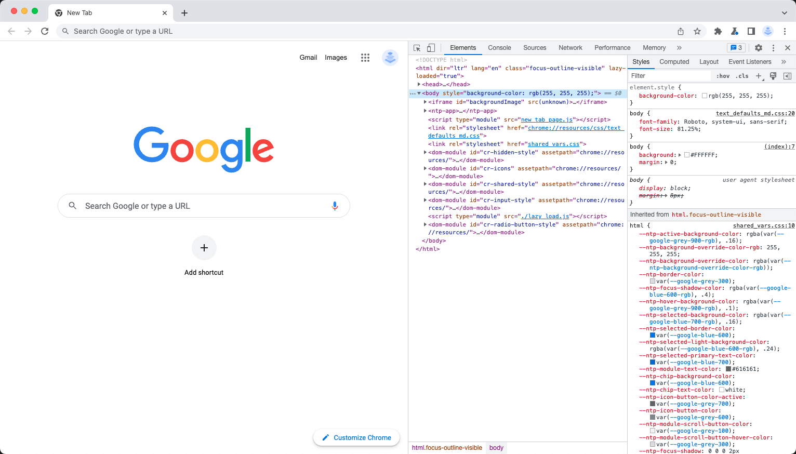
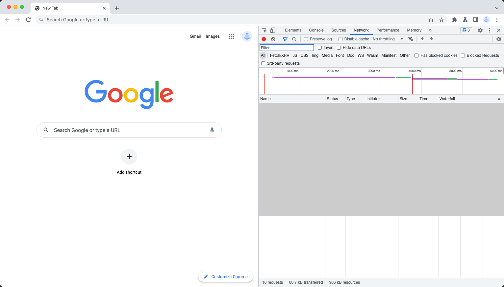
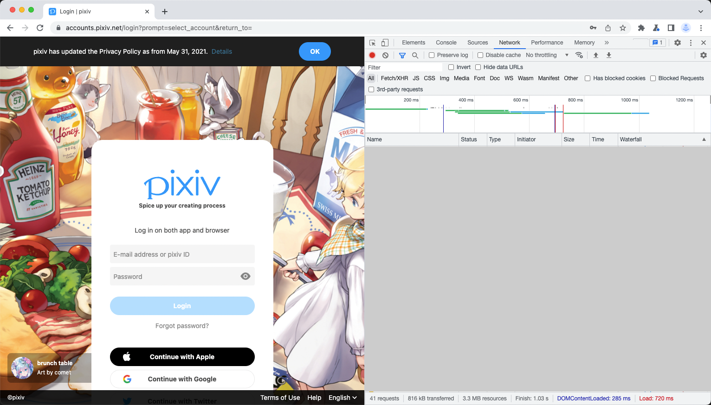

# 关于登录

为了登录你的 Pixiv 账号，你需要一个能访问 Pixiv 且支持开发者模式的浏览器，除了 Safari，这玩意不支持 :)。

> 如果你需要在如无头服务器等没有 GUI 的环境中登录的话，你可以在其它电脑中生成授权码，然后再拷贝到程序中。

- **打开开发者工具**

    打开浏览器的开发者模式，如 Chrome 可以通过按 `F12` 打开。

    

    然后切换到 **网络** 标签。

    

- **登录到 Pixiv**

    运行命令 `login`，Pisv 将生成一个 URL。

    ```
    > pisv login
    ```

    > 程序输出的格式和下面的内容类似（`<?>` 中的内容是随机生成的）：
    >
    > ```
    > login url: https://app-api.pixiv.net/web/v1/login?code_challenge=<?>&code_challenge_method=S256&client=pixiv-android
    > code: 
    > ```

    在浏览器中打开 URL 并登录你的 Pixiv 账号。

    

- **复制和粘贴授权码**

    一旦你成功登录了，网络选项卡中会显示一个类似 `pixiv://account/login?code=<code part>&via=login` 的请求 URL。拷贝其中的 code 部分。

    

    现在回到 Pisv。输入（或是直接 `Ctrl + V` 粘贴）代码然后敲一下回车。完成啦！

    > 在如 Unix 或 Linux 等操作系统中，输入密码的时候默认是不显示任何内容的，这是正常现象。

    ```
    > pisv login
      login url: https://app-api.pixiv.net/web/v1/login?code_challenge=XXXXXXXX&code_challenge_method=S256&client=pixiv-android
      code:
      login success
    ```

    
