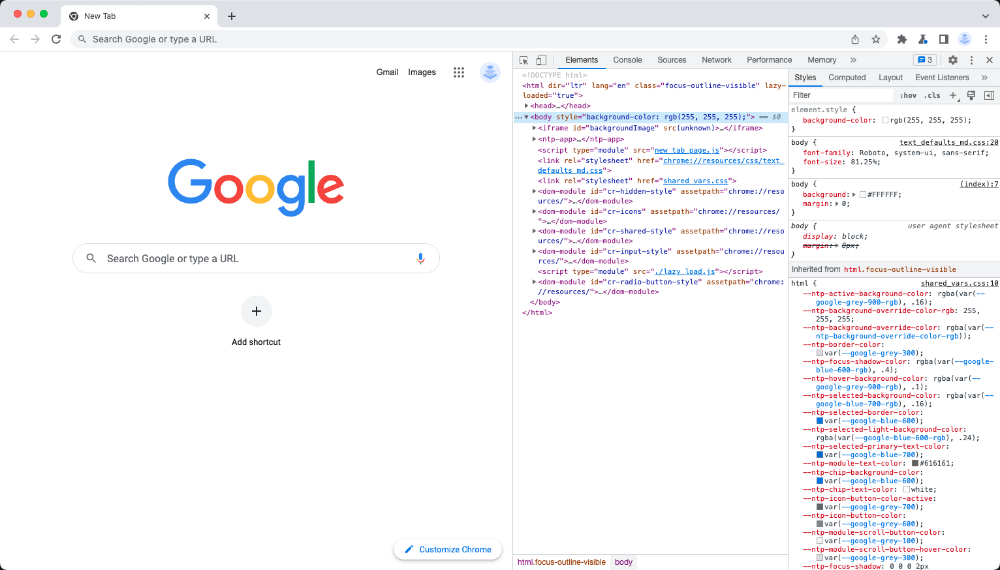
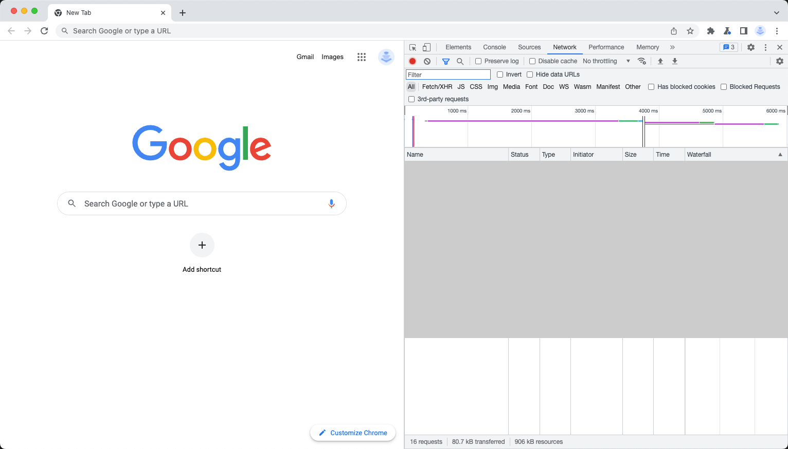
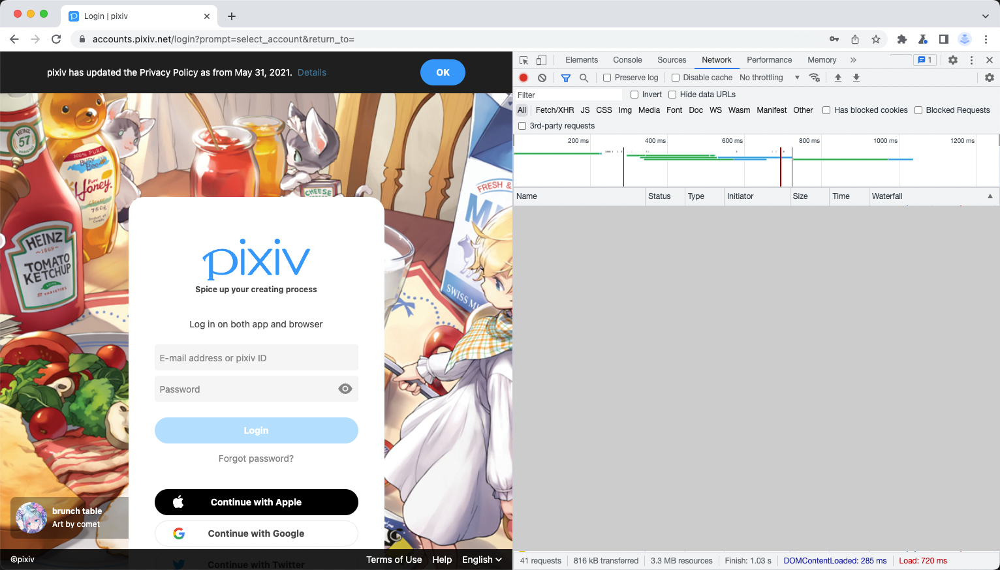
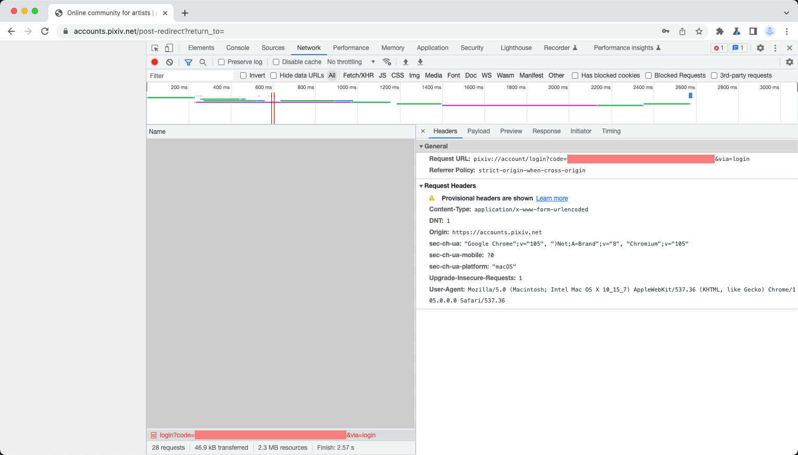

# About Login

In order to log in to your Pixiv account, you need a browser that can access Pixiv and supports development mode, except for Safari, which is unsupported :).

> If you try to run on an environment without GUI like headless server, you can generate authorization code on another computer and then copy it to the program.

- **Open Dev Tool**

    Turn on the development mode of your browser. For example, press `F12` if you are using Chrome.

    

    Then switch to **Network** tab.

    

- **Log in to Pixiv**

    Use command `login`, Pisv will generate an URL.

    ```
    > pisv login
    ```

    > The format of the program output is similar to the following (content of `<?>` is randomly generated):
    >
    > ```
    > login url: https://app-api.pixiv.net/web/v1/login?code_challenge=<?>&code_challenge_method=S256&client=pixiv-android
    > code: 
    > ```

    Open the URL in browser and log in with your Pixiv account.

    

- **Copy and Paste Authorization Code**

    Once you have successfully logged in, the Network tab will display a request URL similar to `pixiv://account/login?code=<code part>&via=login`. Copy the code part.

    

    Now back to Pisv. Input (or just paste using `Ctrl + V`) the code and press Enter. Done!

    > On operation system like Unix or Linux, nothing is displayed by default while entering your password. It is not an error.

    ```
    > pisv login
      login url: https://app-api.pixiv.net/web/v1/login?code_challenge=XXXXXXXX&code_challenge_method=S256&client=pixiv-android
      code:
      login success
    ```

    
